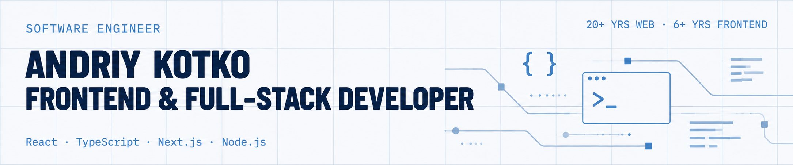
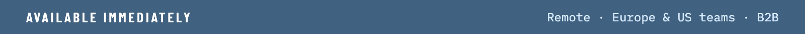
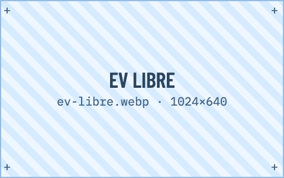
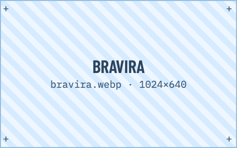
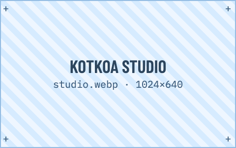

  
  

Frontend Engineer (6+ years) building design systems, GraphQL-driven UIs, and fintech-grade web apps with React, Next.js, and TypeScript. Based in Pego, Valencian Community, Spain.

<table>
<tr>
<td width="33%" valign="top">

**EV Libre** — EV charger discovery and live availability alerts across Spain, with optional push notifications. [Site](https://evlibre.cc)

</td>
<td width="33%" valign="top">

**Bravira** — active tours and outdoor experiences in Spain, including kayaking, SUP, hiking, climbing, and sailing. [Site](https://bravira.es)

</td>
<td width="33%" valign="top">

**Kotkoa Studio** — creative-studio site with a Shopify-backed store. Next.js 16 static export, React 19 + Compiler, Tailwind v4, Jotai. [Site](https://kotkoa.com/) · [Code](https://github.com/Kotkoa/stocker)

</td>
</tr>
</table>

**Data** — GraphQL / Apollo Client, Node.js 
**UI / State** — Tailwind CSS, Redux Toolkit, Jotai 
**Quality** — Playwright, Cypress, Jest 
**Shipping** — Static export, OG images, JSON-LD

## Contact

[LinkedIn](https://www.linkedin.com/in/kotkoa) · [CV](https://kotkoa.github.io/my-cv/) · [Telegram](https://t.me/Kotkoa)

---

Currently learning Spanish (B2 target: 2026).
